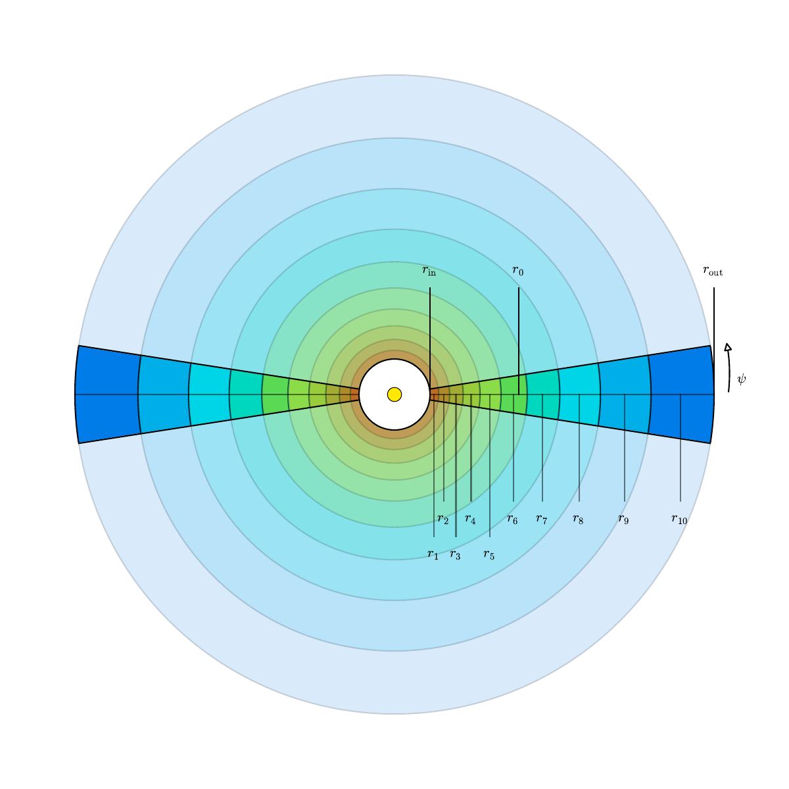

# DDIT2

Code to compute the spectral energy distribution of _optically thin_ debris disks.

This is based on the code that was originally presented in Olofsson et al. (2012), written by Attila Juhasz.

